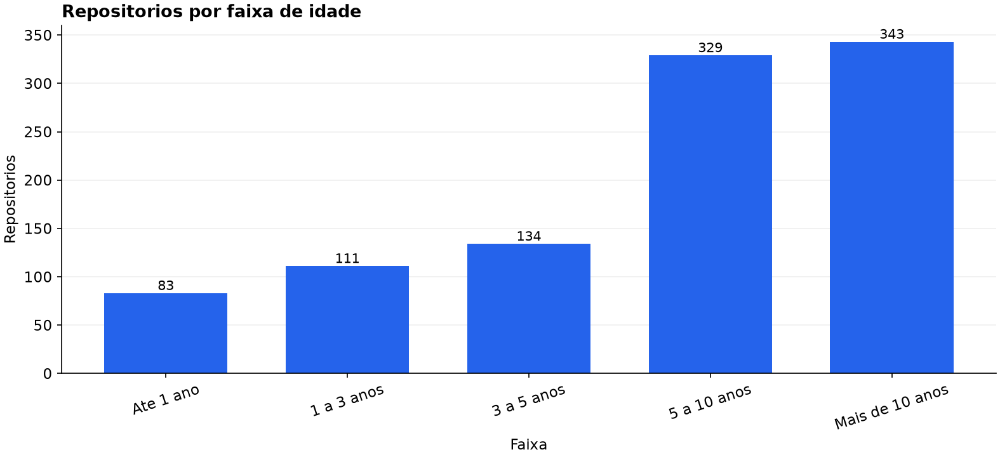
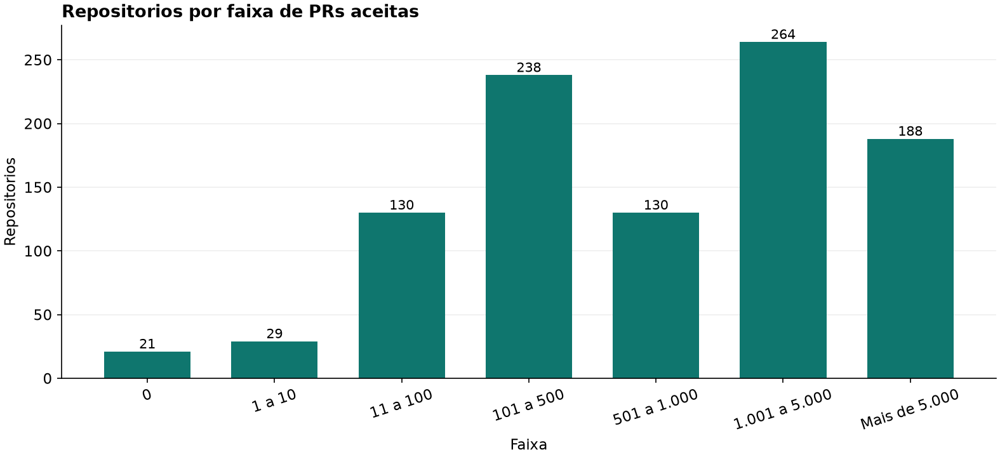
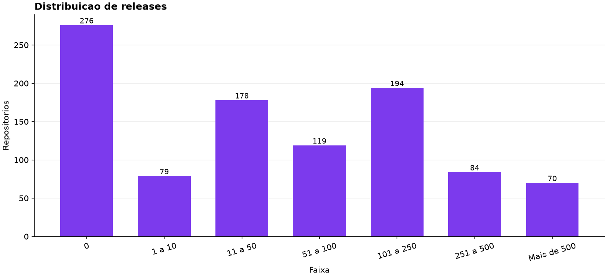
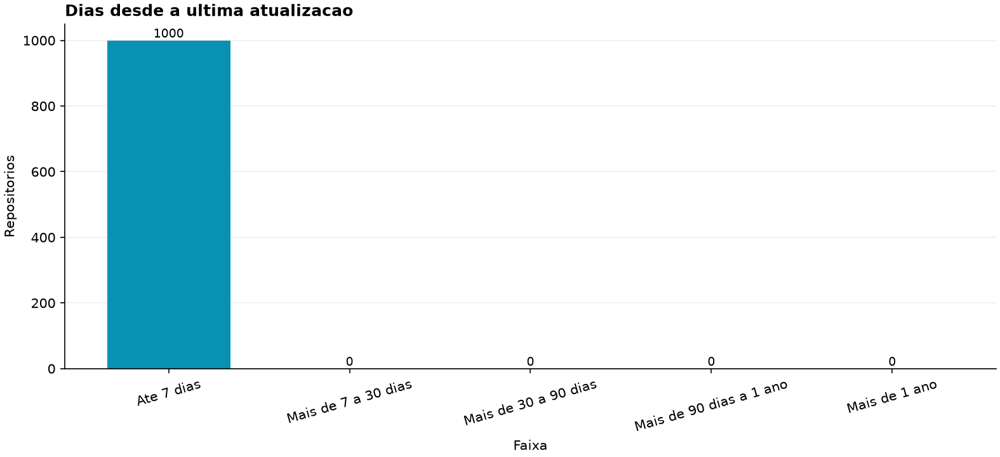
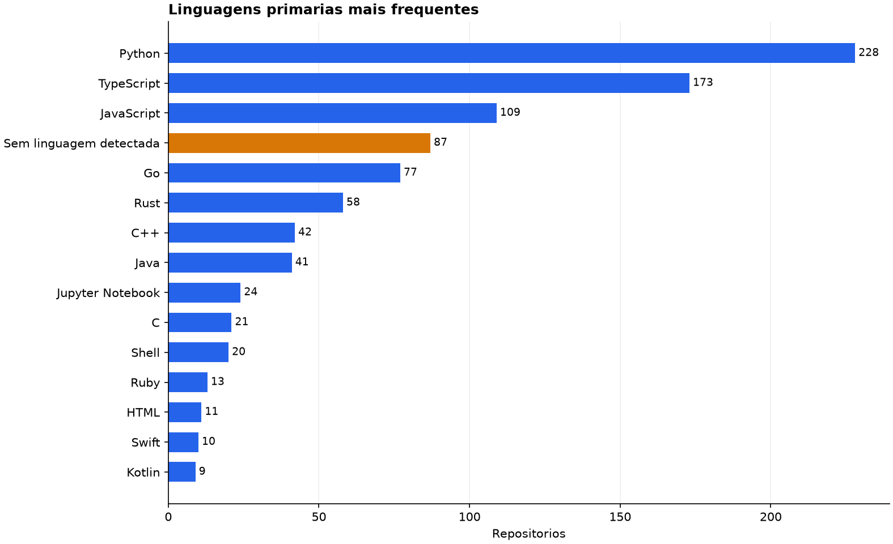
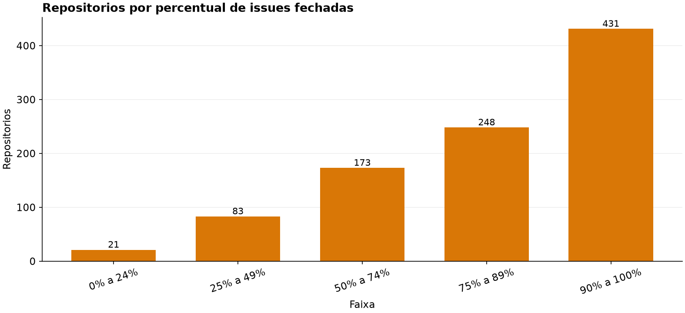
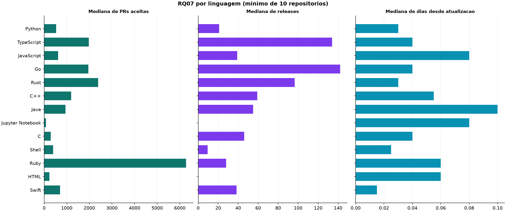

# Lab01S03 - Analise dos repositorios populares do GitHub

## Integrantes e divisao de responsabilidades

- **Flavio de Souza Ferreira Jr:** coleta dos 1.000 repositorios e analise de RQ01, RQ02 e RQ06.
- **Luidi Cadete:** analise de RQ03, RQ04, RQ05 e RQ07, integracao dos resultados na interface e preparacao do snapshot do GitHub Projects.

A parte do Flavio foi preservada no script `github-mining/analyze_lab01_s03.py`. A parte do Luidi foi implementada separadamente em `github-mining/analyze_lab01_s03_luidi.py`.

## Hipoteses informais

### Parte do Flavio

- **RQ01:** repositorios populares tendem a ser maduros, pois acumulam estrelas ao longo dos anos.
- **RQ02:** repositorios populares tendem a receber muitas contribuicoes externas, com uma distribuicao assimetrica causada por projetos muito grandes.
- **RQ06:** projetos populares e ativos tendem a fechar uma parcela alta das issues, embora alguns mantenham grande volume de issues abertas.

### Parte do Luidi

- **RQ03:** a maioria dos repositorios populares possui ao menos uma release, mas projetos sem empacotamento formal formam um grupo relevante.
- **RQ04:** a maioria dos repositorios populares foi atualizada nos ultimos 90 dias.
- **RQ05:** mais da metade dos repositorios com linguagem detectada usa uma das dez linguagens do ranking do GitHub Octoverse 2025.
- **RQ07:** as cinco linguagens mais frequentes apresentam, em conjunto, mais PRs aceitas, mais releases e menos dias desde a atualizacao que as demais linguagens com amostra suficiente.

## Metodologia

A analise usa somente o arquivo `github-mining/output/coleta_1000.csv`, com 1.000 repositorios. Nao foi feita uma nova consulta a API durante o calculo das RQs. Para as variaveis numericas foram calculados minimo, primeiro quartil, mediana, media, terceiro quartil, percentil 90 e maximo. Os outliers foram identificados pelo criterio do intervalo interquartil, usando limites de 1,5 vezes o IQR.

Em RQ05, valores vazios de `primary_language` foram mantidos na distribuicao com o rotulo **Sem linguagem detectada**. A referencia externa adotada foi o [GitHub Octoverse 2025](https://github.blog/news-insights/octoverse/octoverse-a-new-developer-joins-github-every-second-as-ai-leads-typescript-to-1/), cujo ranking por contagem de contribuidores apresenta TypeScript, Python, JavaScript, Java, C#, PHP, Shell, C++, HCL e Go nas dez primeiras posicoes.

Em RQ07, foram comparadas apenas linguagens com pelo menos 10 repositorios. Os 87 itens sem linguagem detectada foram excluidos dessa comparacao. A leitura principal usa medianas, que reduzem a influencia de valores extremos, e e descritiva: nao permite concluir que a linguagem causa as diferencas observadas.

## Resultados

### RQ01 - Idade dos repositorios

A mediana foi de **2.819,51 dias**, ou **7,72 anos**. O resultado sustenta a hipotese de que repositorios populares sao, em geral, maduros.



### RQ02 - Pull requests aceitas

A mediana foi de **773,5 PRs aceitas**, enquanto a media chegou a 4.266,22 e o percentil 90 a 9.993. Foram encontrados 124 outliers pelo IQR, confirmando uma distribuicao fortemente assimetrica. O resultado sustenta a existencia de contribuicao externa relevante, mas a media isolada superestima o repositorio tipico.



### RQ03 - Releases

| Estatistica | Valor |
|---|---:|
| Repositorios validos | 1.000 |
| Minimo | 0 |
| Primeiro quartil | 0 |
| Mediana | 41 |
| Media | 128,84 |
| Terceiro quartil | 149,25 |
| Percentil 90 | 354,10 |
| Maximo | 1.000 |
| Sem releases | 276 (27,60%) |
| Outliers por IQR | 94 |

Como 724 repositorios possuem ao menos uma release, os dados sustentam a hipotese da RQ03. A distribuicao e assimetrica: 94 valores ficam acima do limite superior de 373,13 releases. O valor maximo de 1.000 aparece em 23 repositorios, indicando uma concentracao no teto que deve ser considerada ao interpretar os maiores outliers.



### RQ04 - Atualizacao

| Estatistica | Valor em dias |
|---|---:|
| Repositorios validos | 1.000 |
| Minimo | 0,00 |
| Primeiro quartil | 0,02 |
| Mediana | 0,04 |
| Media | 0,11 |
| Terceiro quartil | 0,13 |
| Percentil 90 | 0,23 |
| Maximo | 2,16 |

Todos os 1.000 repositorios foram atualizados nos ultimos 7 dias na coleta atual; consequentemente, tambem estao dentro das janelas acumuladas de 30 e 90 dias. Nenhum ultrapassa um ano. Foram encontrados 68 outliers acima de 0,295 dia, mas ate o maior valor, 2,16 dias, ainda representa atualizacao recente. Os dados sustentam a hipotese da RQ04.



### RQ05 - Linguagem primaria

Foram detectadas **43 linguagens**. Em 87 repositorios (8,70%) a linguagem primaria estava vazia; esses casos aparecem como **Sem linguagem detectada**, sem provocar erro no script.

| Linguagem/categoria | Repositorios | Percentual da amostra |
|---|---:|---:|
| Python | 228 | 22,80% |
| TypeScript | 173 | 17,30% |
| JavaScript | 109 | 10,90% |
| Sem linguagem detectada | 87 | 8,70% |
| Go | 77 | 7,70% |
| Rust | 58 | 5,80% |
| C++ | 42 | 4,20% |
| Java | 41 | 4,10% |
| Jupyter Notebook | 24 | 2,40% |
| C | 21 | 2,10% |
| Shell | 20 | 2,00% |

As dez linguagens do ranking do Octoverse 2025 representam **76,89% dos 913 repositorios com linguagem detectada**. Portanto, os dados sustentam a hipotese definida para RQ05. IQR nao se aplica diretamente a essa variavel categorica.



### RQ06 - Percentual de issues fechadas

A mediana foi de **87,58%** entre os 956 repositorios com denominador valido. Os 44 repositorios sem issues foram excluidos do calculo da razao. O resultado sustenta a hipotese de alta capacidade de fechamento na amostra, sem ignorar a variacao entre projetos.



### RQ07 - Comparacao por linguagem

| Linguagem | Repositorios | Mediana de PRs | Mediana de releases | Mediana de dias desde atualizacao |
|---|---:|---:|---:|---:|
| Python | 228 | 534,5 | 21 | 0,030 |
| TypeScript | 173 | 1.979 | 134 | 0,040 |
| JavaScript | 109 | 617 | 39 | 0,080 |
| Go | 77 | 1.961 | 142 | 0,040 |
| Rust | 58 | 2.391,5 | 96,5 | 0,030 |
| C++ | 42 | 1.200 | 59 | 0,055 |
| Java | 41 | 946 | 55 | 0,100 |
| Jupyter Notebook | 24 | 78 | 0 | 0,080 |
| C | 21 | 294 | 46 | 0,040 |
| Shell | 20 | 393 | 9,5 | 0,025 |
| Ruby | 13 | 6.281 | 28 | 0,060 |
| HTML | 11 | 232 | 0 | 0,060 |
| Swift | 10 | 705 | 38,5 | 0,015 |

As cinco linguagens mais frequentes (Python, TypeScript, JavaScript, Go e Rust) somam 645 repositorios e apresentaram medianas de **1.151 PRs**, **70 releases** e **0,04 dia** desde a atualizacao. As demais linguagens elegiveis, com 182 repositorios, apresentaram medianas de **595 PRs**, **22,5 releases** e **0,06 dia**.

O primeiro grupo obteve resultado favoravel nas tres metricas, mas as diferencas internas sao grandes: Python, por exemplo, e a linguagem mais frequente e nao possui as maiores medianas de PRs ou releases. Assim, a hipotese da RQ07 e **sustentada parcialmente** como associacao descritiva, sem evidencia de causalidade.



## Integracao e reproducibilidade

O comando abaixo regenera os resultados da Sprint 3, os quatro graficos do Luidi, o JSON separado `luidi_results.json` e o JSON combinado `sprint3_results.json`:

```bash
cd Laboratorio1/github-mining
python3 analyze_lab01_s03_luidi.py
```

A interface web usa o mesmo script no botao **Gerar analise S03** e exibe as sete RQs. A aba **Linguagens e RQ07** apresenta o resumo de RQ05, a referencia do Octoverse e a tabela comparativa de RQ07. Quando o CSV nao existe, o backend continua retornando uma lista vazia e a interface mostra o estado sem dados.

## Processo e snapshot do Project

O processo do grupo usa as colunas `Backlog -> To Do -> Doing -> Review -> Done`, com limite sugerido de dois cards em `Doing`, um por integrante ativo. O script `github-mining/project_snapshot.py` e a interface agora usam por padrao o nome final:

```text
github-mining/snapshots/lab01s03_project_snapshot.csv
```

O snapshot e gerado com:

```bash
python3 project_snapshot.py --owner USUARIO --owner-type user --project-number NUMERO
```

Na validacao local, o token disponivel possuia apenas o escopo `public_repo`. A exportacao real permanece dependente de um token com `read:project` e da identificacao do numero do Project; nenhum snapshot foi inventado.

## Conclusao

Os resultados sustentam as hipoteses de RQ01, RQ03, RQ04, RQ05 e RQ06. RQ02 confirma contribuicao externa relevante, mas com forte assimetria. RQ07 e sustentada parcialmente: o grupo das cinco linguagens mais frequentes teve desempenho favoravel nas tres medianas agregadas, embora haja variacao substancial entre linguagens e nao seja possivel afirmar causalidade.
