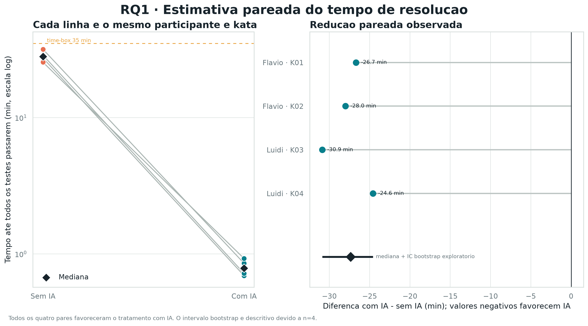
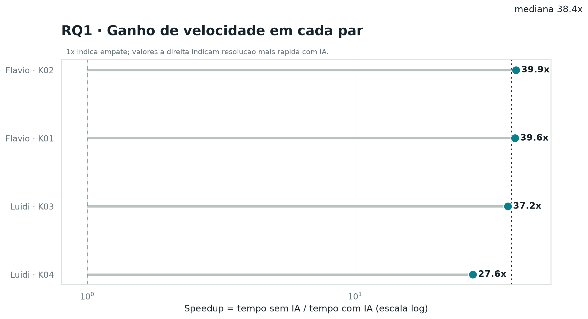
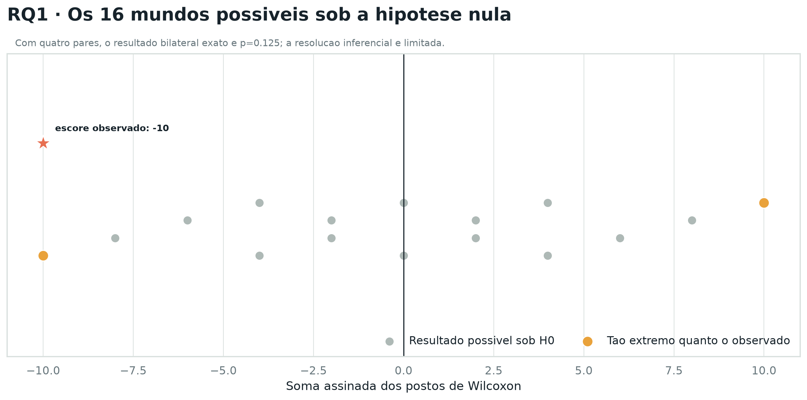
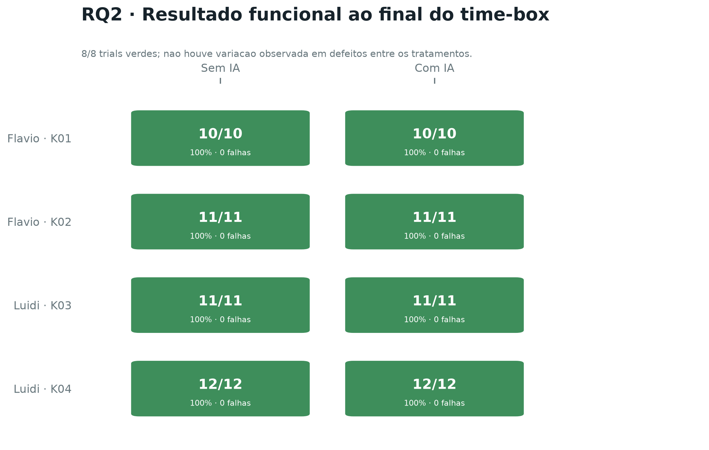

# Resultados preliminares - RQ1 e RQ2

## Base analisada

A analise considera os oito trials registrados em `data/trials.csv`, organizados
em quatro pares participante-kata. Cada par contem uma execucao com IA e outra
sem IA da mesma kata pelo mesmo participante. O script valida a integridade dos
pares, preserva observacoes censuradas no limite do time-box e usa o tempo ate
todos os testes passarem como medida primaria de RQ1.

Como a amostra e pequena, os resultados descritivos sao apresentados por mediana
e intervalo interquartil (IQR). A comparacao inferencial usa o teste pareado de
Wilcoxon exato, acompanhado pela correlacao bisserial de postos e pela proporcao
de pares que favorece a IA. O intervalo bootstrap da mediana das diferencas e
apenas exploratorio.

## RQ1 - Tempo de resolucao

| Tratamento | n | Mediana | Q1 | Q3 | IQR |
|---|---:|---:|---:|---:|---:|
| Com IA | 4 | 47,185 s | 42,776 s | 52,269 s | 9,493 s |
| Sem IA | 4 | 1.683,500 s | 1.614,754 s | 1.769,104 s | 154,350 s |

Nos quatro pares, o trial com IA terminou antes do correspondente sem IA. A
reducao pareada mediana foi de 1.641,138 segundos (97,39%), e o speedup mediano
foi de 38,38 vezes. A correlacao bisserial de postos foi `-1,0` para a diferenca
`com IA - sem IA`, indicando que todas as diferencas observadas apontaram na
mesma direcao.

O teste de Wilcoxon bilateral exato produziu `W = 0` e `p = 0,125`. O teste
direcional exploratorio produziu `p = 0,0625`. Portanto, com nivel de
significancia de 5%, nao se rejeita a hipotese nula no teste bilateral. Esse
resultado nao significa ausencia de efeito: ele mostra que quatro pares oferecem
pouca resolucao inferencial, mesmo com uma diferenca observada grande e
consistente. A conclusao preliminar de RQ1 e que a IA esteve associada a uma
reducao substancial do tempo nesta amostra, mas sao necessarias mais observacoes
para confirmar estatisticamente o efeito.







## RQ2 - Defeitos ao fim do trial

Todos os oito trials passaram 100% dos testes de aceitacao e terminaram com zero
testes falhando. As medianas da taxa de sucesso foram 100% nos dois tratamentos,
com IQR igual a zero. Como todas as diferencas pareadas sao zero, nao ha variacao
para estimar um efeito e o teste de Wilcoxon nao e aplicavel; o script registra
essa condicao explicitamente em vez de forcar um resultado estatistico.

Assim, os dados atuais nao permitem afirmar que a IA reduziu defeitos. Para RQ2,
a hipotese nula nao e rejeitada e o resultado deve ser reportado como
inconclusivo quanto a diferenca entre tratamentos, com desempenho funcional
perfeito em ambos.



## Reproducao

Na raiz de `Laboratorio2`, execute:

```bash
source .venv/bin/activate
python3 analysis/rq1_rq2_analysis.py
```

O comando recria as tabelas em `analysis/results/` e as figuras em PNG e SVG em
`analysis/figures/`. O resumo JSON inclui o hash SHA-256 do CSV de entrada para
rastrear exatamente a base usada na analise.
