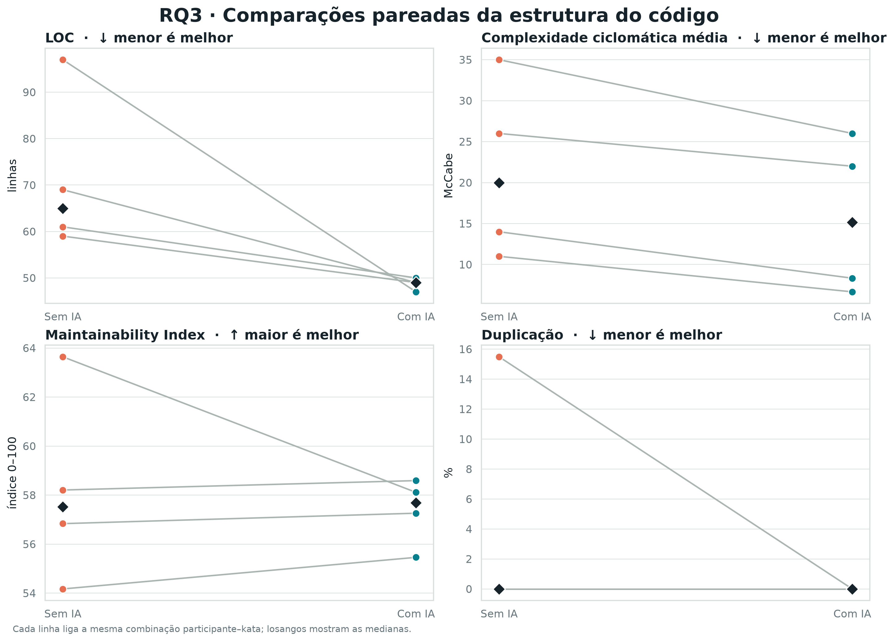
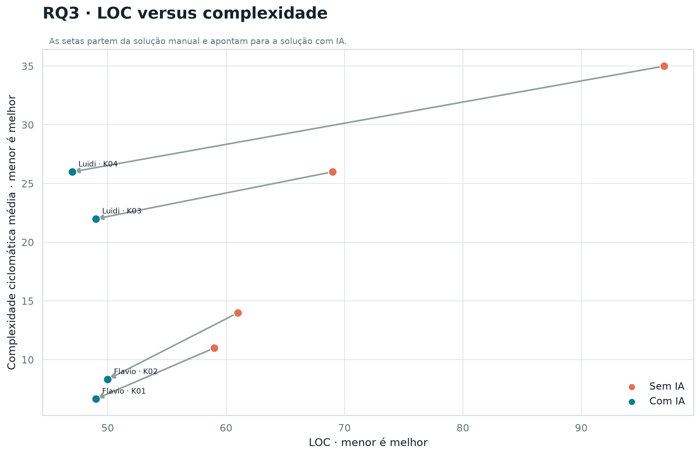
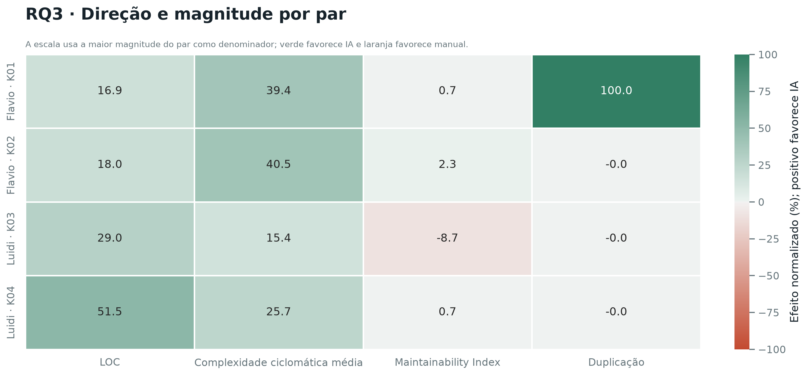
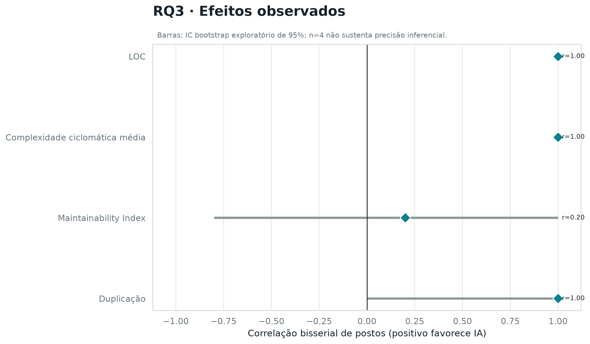
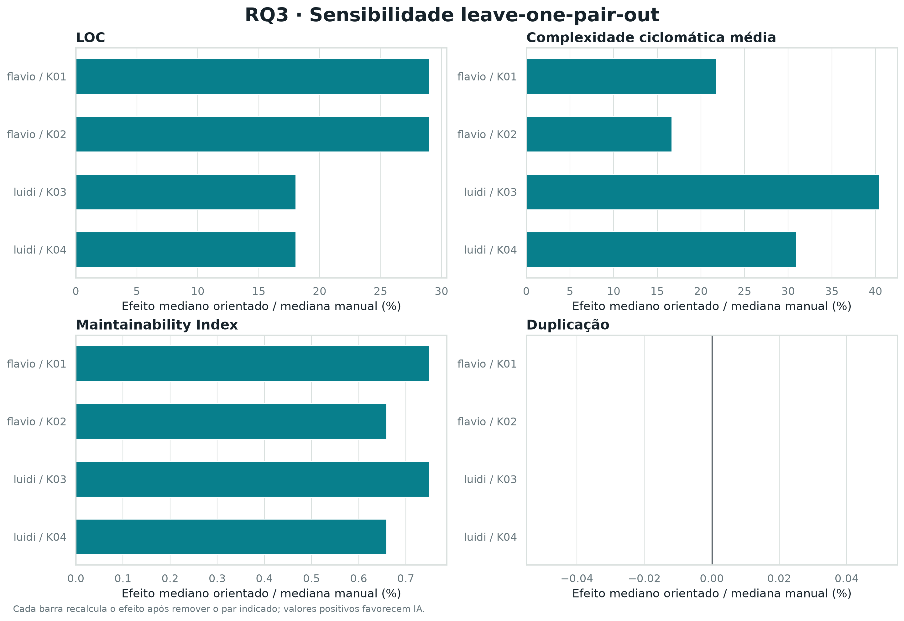

# Resultados preliminares - RQ3

## Base e metodologia

A analise usa os oito registros oficiais de `data/static_metrics.csv` e verifica
sua correspondencia exata com os oito trials de `data/trials.csv`. A unidade
pareada e a combinacao participante-kata: Flavio nas katas 01 e 02 e Luidi nas
katas 03 e 04. Cada um dos quatro pares possui uma observacao `com_ia` e outra
`sem_ia`.

Foram analisadas quatro metricas: LOC, complexidade ciclomatica media por funcao,
Maintainability Index (MI) e percentual de duplicacao. Menores valores favorecem
LOC, complexidade e duplicacao; valores maiores favorecem MI. A diferenca bruta e
sempre calculada como `com IA - sem IA`, enquanto os tamanhos de efeito sao
orientados para que valores positivos favorecam IA.

Devido a `n = 4`, mediana e IQR sao as estatisticas descritivas principais. O
script aplica Wilcoxon pareado bilateral exato quando nao ha empates ou zeros e
enumeracao permutacional exata dos sinais quando eles existem. Diferencas todas
iguais a zero sao reportadas como nao testaveis. Tambem sao apresentados
correlacao bisserial de postos, proporcao de pares favoraveis, intervalos
bootstrap exploratorios com 20.000 reamostragens, correcao de Holm exploratoria
para as quatro metricas e sensibilidade leave-one-pair-out.

## Resultados descritivos

| Metrica | Com IA: mediana (IQR) | Sem IA: mediana (IQR) | Diferenca mediana IA - manual |
|---|---:|---:|---:|
| LOC | 49,000 (0,750) | 65,000 (15,500) | -15,500 linhas |
| Complexidade media | 15,167 (15,084) | 20,000 (15,000) | -5,000 |
| Maintainability Index | 57,687 (1,421) | 57,521 (3,397) | +0,405 |
| Duplicacao | 0,000% (0,000) | 0,000% (3,873) | 0,000 p.p. |



## Interpretacao por metrica

### LOC

Todos os quatro pares produziram menos linhas com IA. A diferenca mediana foi de
`-15,5` linhas e o intervalo bootstrap exploratorio da mediana foi de `-50,0` a
`-10,0`. A correlacao bisserial orientada foi `1,0`. O Wilcoxon bilateral exato
resultou em `W = 0`, `p = 0,125` e `p Holm = 0,500`. Ha consistencia descritiva,
mas nao evidencia inferencial suficiente a 5%.

### Complexidade ciclomatica media

Os quatro pares tambem favoreceram IA em complexidade. A diferenca mediana foi
`-5,0`, com intervalo bootstrap exploratorio de `-9,0` a `-4,0` e correlacao
bisserial orientada `1,0`. O resultado foi `W = 0`, `p = 0,125` e
`p Holm = 0,500`. A conclusao e semelhante a LOC: efeito observado consistente,
sem potencia para confirmacao estatistica.



### Maintainability Index

Tres dos quatro pares favoreceram IA. A diferenca mediana foi pequena,
`+0,405`, e o intervalo bootstrap exploratorio (`-5,530` a `+1,289`) atravessa
zero. A correlacao bisserial orientada foi `0,2`; o teste produziu `W = 4`,
`p = 0,875` e `p Holm = 1,000`. Nao ha indicacao robusta de mudanca em MI.

### Duplicacao

As solucoes com IA tiveram mediana de 0% e as manuais tambem. Tres pares
empataram em zero; o quarto favoreceu IA. Por isso, a mediana da diferenca e zero
e apenas um par efetivo entra na permutacao exata (`W = 0`, `p = 1,000`,
`p Holm = 1,000`). A correlacao bisserial dos pares nao nulos vale `1,0`, mas
nao deve ser interpretada isoladamente: ela representa somente uma observacao
nao empatada.





## Sensibilidade e resposta preliminar de RQ3

A analise leave-one-pair-out recalcula cada efeito apos remover, sucessivamente,
cada uma das quatro unidades pareadas. LOC e complexidade mantem direcao
favoravel a IA em todos os cenarios. MI e mais sensivel ao par removido, e
duplicacao permanece dominada pelos empates.



Como resposta preliminar de RQ3, o uso de IA esteve associado a solucoes menores
e de menor complexidade nos quatro pares observados. Nao foi identificada uma
diferenca consistente em Maintainability Index ou duplicacao. Nenhuma comparacao
atingiu significancia a 5%, antes ou depois da correcao de Holm; portanto, os
resultados descrevem a amostra e nao confirmam causalmente um efeito estrutural.

## Limitacoes

- `n = 4` oferece resolucao muito baixa ao Wilcoxon: mesmo quatro diferencas na
  mesma direcao resultam em `p = 0,125` no teste bilateral.
- Cada participante resolveu katas diferentes; o pareamento controla apenas a
  comparacao dentro da mesma combinacao participante-kata.
- Os intervalos bootstrap sao exploratorios e instaveis com quatro unidades.
- A duplicacao tem tres empates em zero, deixando apenas um par informativo.
- LOC e complexidade dependem do estilo de implementacao e devem ser lidos em
  conjunto com MI, duplicacao e os resultados funcionais.
- A correcao de Holm reduz ainda mais a potencia, embora proteja contra a leitura
  seletiva das quatro metricas.

## Reproducao

Na raiz de `Laboratorio2`:

```bash
python3 analysis/rq3_analysis.py
```

O comando valida os CSVs, recria as tabelas em `analysis/results/` e as figuras
PNG/SVG em `analysis/figures/`. `rq3_summary.json` registra o SHA-256 dos dois
arquivos de entrada, permitindo verificar exatamente qual base gerou a analise.
